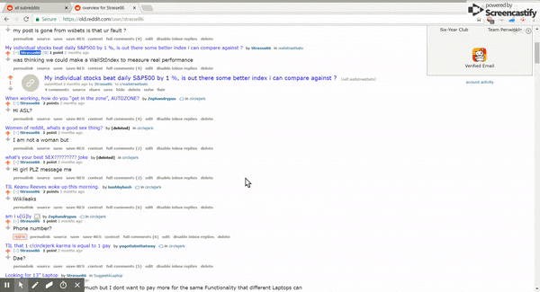

# Reddit User Explorer

Explore the past posts and comments of Reddit users via the Chrome Extension.

## Link:

https://chrome.google.com/webstore/detail/reddit-user-explorer/gophgjgjlollkjofchhmjhekpmdiaeob


## How to use:


After Installation, Control & Left-Click on any Reddit username. 

Once the past posts and comments are fetched, they will be displayed in a new Chrome Tab.


## Demo:


## Screenshots:


## Limitations:

Reddit API recommends that a request should be done once every second. We respect this limit therefore users with 
multiple posts/comments are fetched in batches of 100 which is the maximum that can be fetched per request.

Additionally, Reddit API returns at most the last 1000 posts and 1000 comments per user.

## Donate:

If you like this Extension and you would like more features, feel free to send your suggestions.

######  BTC Donations: 12PDrPtoEvWHTxJDZT1CZq1pozrzevR5cq

## Code breakdown:

The extension is broken into several files, let's see the most important of them

1. Manifest 

The manifest is the only file a chrome extension must have and it should be named **manifest.json**

Here is the current [manifest.json](https://github.com/strasse86/Reddit-User-Explorer/blob/master/manifest.json) 

```
   {
    "name": "Reddit User Explorer",
    "version": "0.2",
    "description": "Find Posts and Comments distrubution of Reddit Users",
	"options_ui": {
		"page"        : "html/options.html",
		"open_in_tab" : false },
	"content_scripts": [
    {
	  "matches": ["https://*.reddit.com/*"],
      "all_frames": false,
      "js": ["js/jquery.js","js/content.js"]
    }
  ],"background": {
      "scripts": ["js/background.js"],
      "persistent": false
    },
	"browser_action" :
	{
		"default_icon": 
	{                   
            "16" : "images/icon16.png",
			"24" : "images/icon24.png",
			"32" : "images/icon32.png",
			"128": "images/icon_128.png"
    },
		 "default_title": "Reddit User Explorer"
	}, 
	"icons" : {
		"48" : "images/icon48.png",
		"128": "images/icon_128.png"
	},
    "manifest_version": 2
  }

```
**name**, **version** and **description** are self explanatory.

```
"options_ui": {
		"page"        : "html/options.html",
		"open_in_tab" : false },
```
Here we define the [options.html](https://github.com/strasse86/Reddit-User-Explorer/blob/master/html/options.html) page of the extension. This is where the end user can select options, if they are defined by the extension.
**open_in_tab** is a boolean that is set to false, meaning that the options page will not open in a new tab but in a pop up like below:


```
"content_scripts": [
    {
	  "matches": ["https://*.reddit.com/*"],
      "all_frames": false,
      "js": ["js/jquery.js","js/content.js"]
    }
```

Here we define the pages where the content scripts will run. Content scripts are running in the contect of the webpage that is defined under **matches**.
If the user visits for example https://www.reddit.com/r/all the content scripts **jquery.js** and **content.js** will run in the context of it.

That means that we can listen on events that are happening under the matched urls.  Let's see what **content.js** contains.


```javascript
var port = chrome.runtime.connect({name: "inject"});

document.body.addEventListener("click", function(ev) {
	//console.log("clicked");
	if (ev.ctrlKey) {
		try {
			var url = ev.target.href;
			if ( url.includes("/user") &&  url.includes != undefined && url.includes != 0 ){
				var n = url.match(new RegExp("user/" + "(.*)" +'' ));
				var user = n[1];
				
				var inj = {
					url : url,
					user: user
				}
				port.postMessage({type: inj});	
				}
			ev.preventDefault();
		}
			catch (ev){
		}
	}
});
```

First we create a port that will be used to communicate to other parts of the extension ( the background pages which are doing the bulk of the work). This is done because there is no other way
to communicate between the injected page and the background of our extension. It is a safety measure taken by default.

Then we add a Listener on the body which listens when a user is pressing the Ctrl Key. Once this is pressed the script is taking the url that is under the mouse.
If this url contains the string "/user" like https://www.reddit.com/user/strasse86 it posts it to the background script which is then going to request all the user's past
comments and posts.

Now to continue the breakdown of the manifest.json let's move to the next part.
```
"background": {
      "scripts": ["js/background.js"],
      "persistent": false
    },
```
This is where the bulk of the work is done. Here for the specific user we request reddit to fetch his comments and posts. Reddit can return at maximum 1000 posts and 1000 comments.
If a user has more than those only the most recent onces will be returned.

Let's see some key functions of background.js


```javascript
chrome.runtime.onConnect.addListener(function(port) {
    //console.log("[background.js] -> Listening on: ",port);	
	port.onMessage.addListener(function(type,sendingPort) {		
		if (typeof type.type != 'undefined' ) {
			var total_comments = {};
			var total_posts    = {};		
			//console.log("[background.js] -> type,port,PORT_ID: ", type.type.url,port,sendingPort.sender.tab.id);
			get_all_urls(type.type.url + "/comments.json?limit=100",total_comments,type.type.user,"comments");
			get_all_urls(type.type.url + "/submitted.json?limit=100",total_posts,type.type.user,"submitted");	
		}
	});	
});	
```

Here is when we wait for the content script to deliver us the username that we want to search. We create two objects **total_comments** and **total_posts** which
will later contain the subreddits the user has posted.

then we call the function **get_all_urls** in order to get all comments and posts.


```javascript
function get_all_urls(full_name,comments_or_posts,user,trigger) {
		var myVar = window.setTimeout(() => { 
				get_url(full_name,comments_or_posts,user,trigger)
				.then((counter) => {
					var next = counter["next"];
					if ( next == null) 	{
						clearTimeout(myVar);
						return;
					}
					get_all_urls(full_name + "&after=" +next ,comments_or_posts,user,trigger);
				})
		}, 2000);
}
```

Reddit recommends that we make 1 request every second in order to not spam their servers. The extension respects this limit making in average 1 request / second.
Every request can fetch at most 100 results, that means that users which have a large amount of posts and comments will take more time to generate.

Once we have populated the  **total_comments** and **total_posts** we sort them by descending order, so that the subreddits with the most comments/post are displayed first.

After the sorting is done we present the results in a new tab, using the echarts.js library.

```javascript
try {
			trigger_when_two = 0
			/* Here we create a tab where we are going to display the  results */
			chrome.tabs.create({url: chrome.runtime.getURL("html/show.html")}, function(t){
				//console.log("[show.js] chrome.tabs.create",t);
			});
```

Now continuing with the manifest json.

```
"browser_action" :
	{
		"default_icon": 
	{                   
            "16" : "images/icon16.png",
			"24" : "images/icon24.png",
			"32" : "images/icon32.png",
			"128": "images/icon_128.png"
    },
		 "default_title": "Reddit User Explorer"
	}, 
	"icons" : {
		"48" : "images/icon48.png",
		"128": "images/icon_128.png"
	},
 ```
 
[Some icon definitions](https://developer.chrome.com/apps/manifest/icons)
 
Under default_icon in browser_action we are displaying the icons that the user sees on the top right side of the browser.
Under icons we see the icons that the user sees when he is browsing his extensions on chrome  
